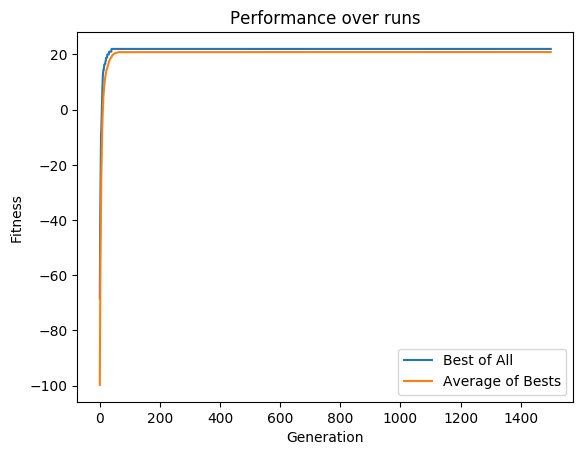

This test uses a mutation probability of 0.001.
See the [Config](config.json) file for more details.

Run this test again by doing:

        $ python ../../../../jb_2016.py -s -c config.json -r 30

# Results

## 30 runs

